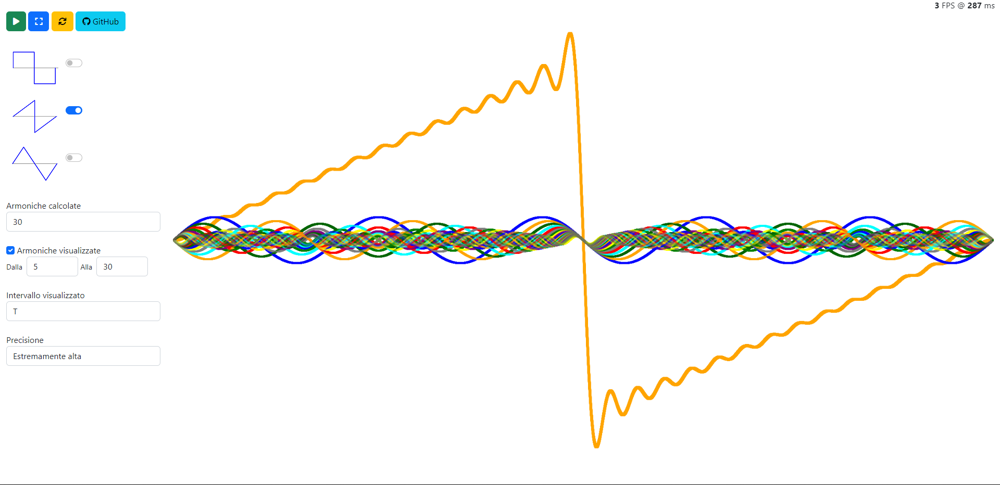

# Rappresentazione visiva di alcune onde elementari attraverso le serie di Fourier
### Di Niccolò Boano & Alberto Gonella

## Utilizzo

- Per utilizzare l'applicativo da browser, cliccare [qui](https://nboano.github.io/Visualizzazione_Serie_Fourier).

- Per eseguire l'applicativo localmente, clonare il repository e
    - Su Windows, eseguire il file ```start.cmd``` (è necessario aver installato il browser Chrome).
    - Su MacOS, eseguire il file ```start.command``` (è necessario aver installato il browser Chrome).
    - Su Linux, eseguire il file ```start.sh``` (è necessario aver installato il browser Chrome).
- In alternativa, su Windows, è possibile scaricare l'eseguibile e mandarlo in esecuzione direttamente. 

## Compilazione

Clonando il repository, l'applicativo viene fornito già compilato. Nel caso in cui lo si volesse ricompilare, ad esempio dopo averne modificato il sorgente, è possibile lanciare il comando seguente:

```bash
lib/kinderc/kccompile src/main.cpp src/main.wasm
```

*(&Egrave; necessario avere installato il compilatore CLANG/LLVM).*

## Screenshots

